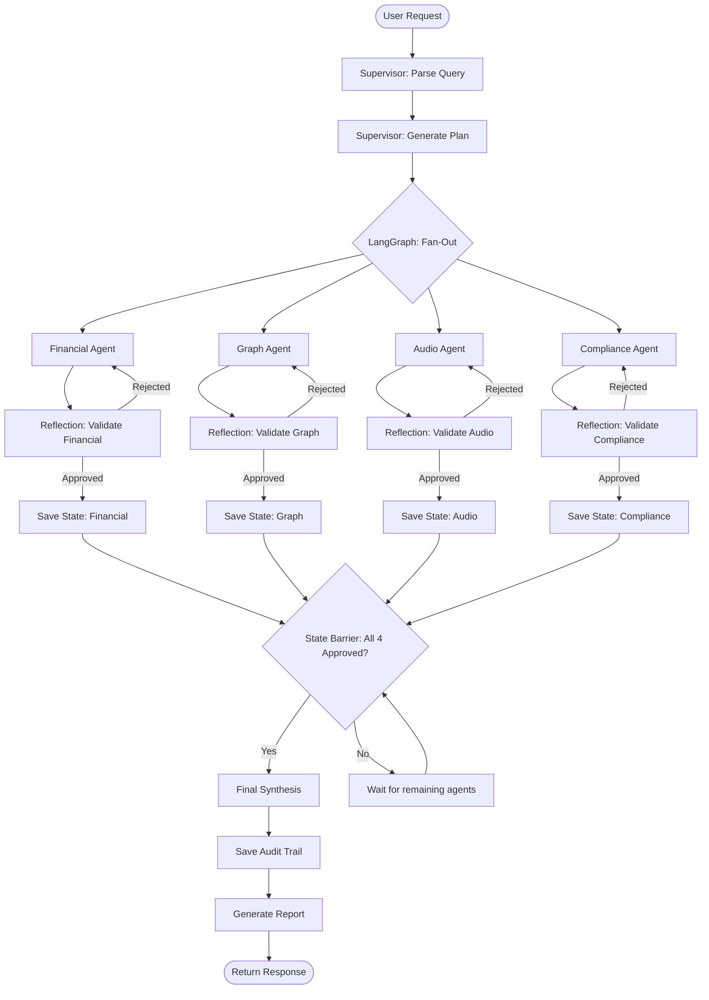

# Orchestration State Machine Contract

**Version:** 1.0.0  
**Owner:** Team A  
**Last Updated:** Sprint 1

---

## Overview

This contract defines the **LangGraph state machine** that orchestrates the investigation workflow. It specifies:
- State transitions
- Retry policies
- Timeout policies
- State synchronization barrier logic

---

## State Diagram



---

## State Definitions

### 1. **PARSE** (Supervisor: Parse Query)
**Input:** `InvestigationRequest`  
**Output:** Parsed entities, investigation type  
**Timeout:** 10 seconds  
**Retry:** No retry (parsing is deterministic)

---

### 2. **PLAN** (Supervisor: Generate Plan)
**Input:** Parsed query  
**Output:** `InvestigationPlan` (list of `AgentTask`)  
**Timeout:** 30 seconds  
**Retry:** 3 attempts with exponential backoff (2s, 4s, 8s)

---

### 3. **FANOUT** (LangGraph: Parallel Execution)
**Input:** `InvestigationPlan`  
**Output:** 4 parallel agent tasks  
**Logic:**
- Group tasks by priority
- Execute all priority 1 tasks in parallel
- Wait for priority 1 to complete before starting priority 2

---

### 4. **AGENT EXECUTION** (Financial, Graph, Audio, Compliance)
**Input:** `AgentTask`  
**Output:** `AgentOutput`  
**Timeout:** 5 minutes per agent  
**Retry:** Handled by Reflection loop (see below)

---

### 5. **REFLECTION** (Validate Agent Output)
**Input:** `AgentOutput`  
**Output:** `ReflectionVerdict` (approve or reject)  
**Timeout:** 30 seconds  
**Retry:** No retry (reflection is deterministic)

**Reflection loop:**
- If approved → proceed to SAVE STATE
- If rejected → send feedback to agent, re-execute agent task
- Max retries: 3 per agent
- If max retries exceeded → mark agent as FAILED, proceed to barrier with partial results

---

### 6. **SAVE STATE** (Persist Approved Output)
**Input:** Approved `AgentOutput`  
**Output:** Database write confirmation  
**Timeout:** 5 seconds  
**Retry:** 3 attempts (database write can fail transiently)

---

### 7. **STATE BARRIER** (Wait for All Agents)
**Logic:**
```python
def check_state_barrier(investigation_id: str) -> bool:
    approved_count = db.count(
        "investigation_states",
        where={"investigation_id": investigation_id, "status": "approved"}
    )
    failed_count = db.count(
        "investigation_states",
        where={"investigation_id": investigation_id, "status": "failed"}
    )
    
    # All 4 agents must be either approved or failed
    total_complete = approved_count + failed_count
    
    if total_complete == 4:
        if approved_count >= 3:
            # At least 3 agents succeeded → proceed to synthesis
            return True
        else:
            # Too many failures → abort investigation
            raise InvestigationFailedError("Insufficient agent approvals")
    else:
        # Wait for remaining agents
        return False
```

**Timeout:** 10 minutes (max time to wait for all agents)  
**Retry:** No retry (barrier is a passive wait)

---

### 8. **SYNTHESIS** (Cross-Domain Reasoning)
**Input:** All approved `AgentOutput` states  
**Output:** `InvestigationReport`  
**Timeout:** 2 minutes  
**Retry:** 3 attempts with exponential backoff

---

### 9. **AUDIT** (Save Audit Trail)
**Input:** Full investigation context  
**Output:** Audit trail ID  
**Timeout:** 10 seconds  
**Retry:** 3 attempts (critical for legal defensibility)

---

### 10. **REPORT** (Generate Final Report)
**Input:** `InvestigationReport`  
**Output:** Formatted report (JSON + markdown)  
**Timeout:** 5 seconds  
**Retry:** No retry (formatting is deterministic)

---

## Retry Policies

### Exponential Backoff
```python
def exponential_backoff(attempt: int, base_delay: float = 2.0) -> float:
    """
    Calculate delay before retry.
    
    attempt=1 → 2s
    attempt=2 → 4s
    attempt=3 → 8s
    """
    return base_delay ** attempt
```

### Jitter (Randomization)
```python
import random

def jitter(delay: float) -> float:
    """Add ±20% randomization to prevent thundering herd."""
    return delay * random.uniform(0.8, 1.2)
```

### Combined Retry Logic
```python
for attempt in range(1, max_retries + 1):
    try:
        result = execute_task()
        return result
    except RetryableError as e:
        if attempt == max_retries:
            raise MaxRetriesExceededError()
        
        delay = jitter(exponential_backoff(attempt))
        time.sleep(delay)
```

---

## Timeout Policies

| State | Timeout | Action on Timeout |
|---|---|---|
| PARSE | 10s | Fail immediately (no retry) |
| PLAN | 30s | Retry up to 3 times |
| AGENT EXECUTION | 5min | Mark agent as FAILED, proceed to barrier |
| REFLECTION | 30s | Fail immediately (no retry) |
| SAVE STATE | 5s | Retry up to 3 times |
| STATE BARRIER | 10min | Fail investigation if not all agents complete |
| SYNTHESIS | 2min | Retry up to 3 times |
| AUDIT | 10s | Retry up to 3 times |
| REPORT | 5s | Fail immediately (no retry) |

---

## LangGraph Implementation

```python
from langgraph.graph import StateGraph, END
from typing import TypedDict, List

class InvestigationState(TypedDict):
    investigation_id: str
    query: str
    plan: InvestigationPlan
    agent_outputs: List[AgentOutput]
    synthesis_result: InvestigationReport
    audit_trail_id: str

# Define the graph
workflow = StateGraph(InvestigationState)

# Add nodes
workflow.add_node("parse", parse_query)
workflow.add_node("plan", generate_plan)
workflow.add_node("financial_agent", execute_financial_agent)
workflow.add_node("graph_agent", execute_graph_agent)
workflow.add_node("audio_agent", execute_audio_agent)
workflow.add_node("compliance_agent", execute_compliance_agent)
workflow.add_node("reflection", validate_outputs)
workflow.add_node("state_barrier", check_all_agents_complete)
workflow.add_node("synthesis", synthesize_report)
workflow.add_node("audit", save_audit_trail)

# Define edges
workflow.set_entry_point("parse")
workflow.add_edge("parse", "plan")
workflow.add_conditional_edges(
    "plan",
    fan_out_agents,
    {
        "financial": "financial_agent",
        "graph": "graph_agent",
        "audio": "audio_agent",
        "compliance": "compliance_agent"
    }
)
workflow.add_edge("financial_agent", "reflection")
workflow.add_edge("graph_agent", "reflection")
workflow.add_edge("audio_agent", "reflection")
workflow.add_edge("compliance_agent", "reflection")
workflow.add_conditional_edges(
    "reflection",
    check_reflection_verdict,
    {
        "approved": "state_barrier",
        "rejected": "retry_agent"  # Loop back to agent
    }
)
workflow.add_conditional_edges(
    "state_barrier",
    check_barrier_status,
    {
        "complete": "synthesis",
        "waiting": "state_barrier"  # Wait loop
    }
)
workflow.add_edge("synthesis", "audit")
workflow.add_edge("audit", END)

# Compile the graph
app = workflow.compile()
```

---

## Error Handling

### Partial Report Generation
If 1 agent fails (max retries exceeded), proceed with partial results:

```python
if approved_count >= 3:
    # Generate report with warning
    report = synthesize_report(approved_outputs)
    report.warnings.append(f"{failed_agent} failed after 3 retries")
    return report
else:
    # Too many failures, abort investigation
    raise InvestigationFailedError("Insufficient agent approvals")
```

### Investigation Failure
If investigation fails at any critical step:

```python
{
  "investigation_id": "inv_12345",
  "status": "failed",
  "error": "Synthesis timeout after 3 retries",
  "partial_results": {
    "financial": {...},
    "graph": {...}
  }
}
```
